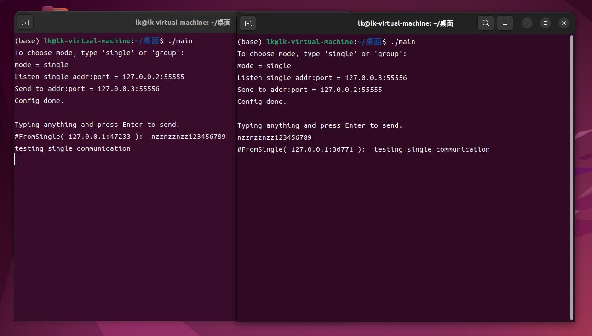
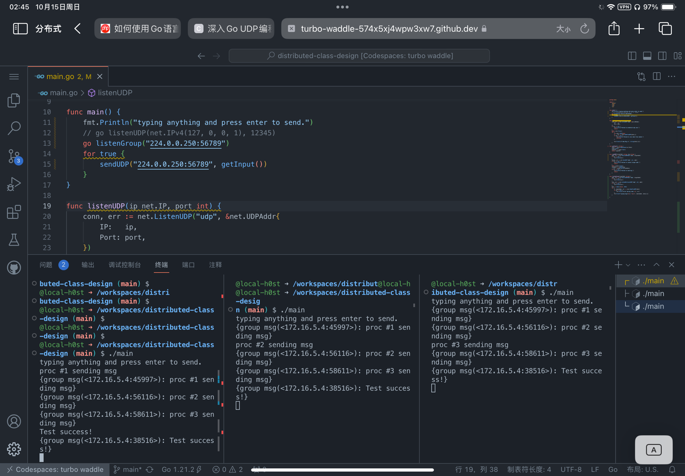

# 分布式实验报告
57121117倪哲振

### 设计思路与实现
程序使用golang实现，主线程负责读取用户输入并发送消息，再开一个goroutine负责监听UDP消息。程序运行时有两种工作模式，一种是点对点通信，一种是组播通信。

点对点通信监听函数如下：
```
func listenUDP(targetAddr string) {
	addr, err := net.ResolveUDPAddr("udp", targetAddr)
	if err != nil {
		fmt.Println(err)
	}
	conn, err := net.ListenUDP("udp", addr)
	if err != nil {
		fmt.Println("Failed to establish udp conn.")
		return
	}
	defer conn.Close()
	for {
		var data [1024]byte
		n, _, err := conn.ReadFromUDP(data[:])
		if err != nil {
			fmt.Println("Failed to recv data from remote.")
			continue
		}

		fmt.Println("# New Msg =>", string(data[:n]))
	}
}
```
组播通信监听函数如下：
```
func listenGroup(targetAddr string) {
	addr, err := net.ResolveUDPAddr("udp", targetAddr)
	if err != nil {
		fmt.Println(err)
	}
	conn, err := net.ListenMulticastUDP("udp", nil, addr)
	if err != nil {
		fmt.Println(err)
	}
	data := make([]byte, 1024)
	for {
		n, remoteAddr, err := conn.ReadFromUDP(data)
		if err != nil {
			fmt.Printf("error during read: %s", err)
		}
		fmt.Printf("{group msg(<%s>): %s}\n", remoteAddr, data[:n])
	}

}
```

### 测试
* 两个进程点对点通信
* 多个进程之间组播通信

#### 两个进程测试点对点通信


可以看到在指定监听地址和发送地址后两个进程可以相互通信，功能正常。


#### 多个进程测试组播通信

我们在本地开了三个进程，组播通信地址为224.0.0.250:56789，可以看到三个进程加入同一个组播组后可以发送和接收组播消息，功能测试正常。