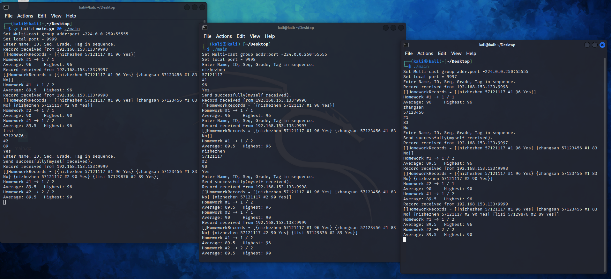

# 分布式实验（三）

## 发送消息

不同语言之间进行信息传递要保证无二义性，因此我们决定采用json格式，把信息存在结构体中，序列化为json字符串进行消息传递，收到json消息的时候再反序列化为结构体。

因此我们规定一条作业消息记录如下：

```go
type HOMEWORK_INFO struct {
	Name  string
	ID    string
	Seq   string
	Grade string
	Tag   string
}
```

使用string类型是为了保证兼容性，因为不同语言的客户端解析json时，对不同数据类型可能有不同的表示方法，例如bool类型区分大小写（true和True）等，此外，考虑到作业序号可能包含非数字字符、成绩评定也可能使用ABCD而非分数，故也应该采用string类型。

我们构造json消息的函数如下：

```go
func generateHomeworkInfo() string {
	fmt.Println("Enter Name, ID, Seq, Grade, Tag in sequence.")
	h := HOMEWORK_INFO{
		Name:  getInput(),
		ID:    getInput(),
		Seq:   getInput(),
		Grade: getInput(),
		Tag:   getInput(),
	}
	s, _ := json.Marshal(h)
	return string(s)
}
```

我们依次输入五个值，然后会得到可用于发送的json字符串，直接发送即可。

## 接收消息

当我们收到json消息后，我们需要对其反序列化，构建出对应的结构体来存储信息：

```go
var HomeworkRecords []HOMEWORK_INFO

func handleInfo(jsonstr string, raddr *net.UDPAddr) {
	...
	h := HOMEWORK_INFO{}
	err := json.Unmarshal([]byte(jsonstr), &h)
	if err != nil {
		fmt.Println("Msg json received but unmarshal failed: " + jsonstr)
		return
	}
	HomeworkRecords = append(HomeworkRecords, h)
	fmt.Println("Record received from " + raddr.String())
	fmt.Println("[]HomeworkRecords =", HomeworkRecords)
	...
}
```

每一条json消息都会构建出一个对应的结构体，所有结构体存在数组`HOMEWORK_INFO`中。

每收到一条消息我们就需要更新该次作业相关的统计信息。每一次作业的统计信息存储在如下的结构体中，作业-统计信息以键值对的方式存储在名叫`statics`的map中：

```go
type STATIC_INFO struct {
	Total       int
	InTimeCount int
	Sum         float64
	Highest     float64
}

var statics map[string]*STATIC_INFO
```

每收到一条消息我们就需要更新该次作业相关的统计信息：

```go
func handleInfo(jsonstr string, raddr *net.UDPAddr) {
	...
	// update the statics
	_, keyExists := statics[h.Seq]
	if !keyExists {
		statics[h.Seq] = &STATIC_INFO{
			Total:       0,
			InTimeCount: 0,
			Sum:         0,
			Highest:     0,
		}
	}
	statics[h.Seq].Total++
	grade, _ := strconv.ParseFloat(h.Grade, 64)
	statics[h.Seq].Sum += grade
	if grade > statics[h.Seq].Highest {
		statics[h.Seq].Highest = grade
	}
	if h.Tag == "Yes" {
		statics[h.Seq].InTimeCount++
	}
	...
}
```

更新之后我们就可以随时输出了。

## 测试



上面的测试进行了4步：

1. 中窗口发送`nizhezhen`第`#1`次作业情况

   在另外两个窗口的输出可以看到被记录下来，统计信息也符合预期

2. 右窗口发送`zhangsan`第`#1`次作业情况

   被记录，且统计信息的平均值89.5，最高96，1人按时，总共2份作业，也符合预期

3. 中窗口发送`nizhezhen`第`#2`次作业情况

   输出信息可以看到2次作业分别的统计信息，且符合预期

4. 左窗口发送`lisi`第`#2`次作业情况

   平均值、最高、按时提交人数、总人数均符合预期

测试结构均符合预期